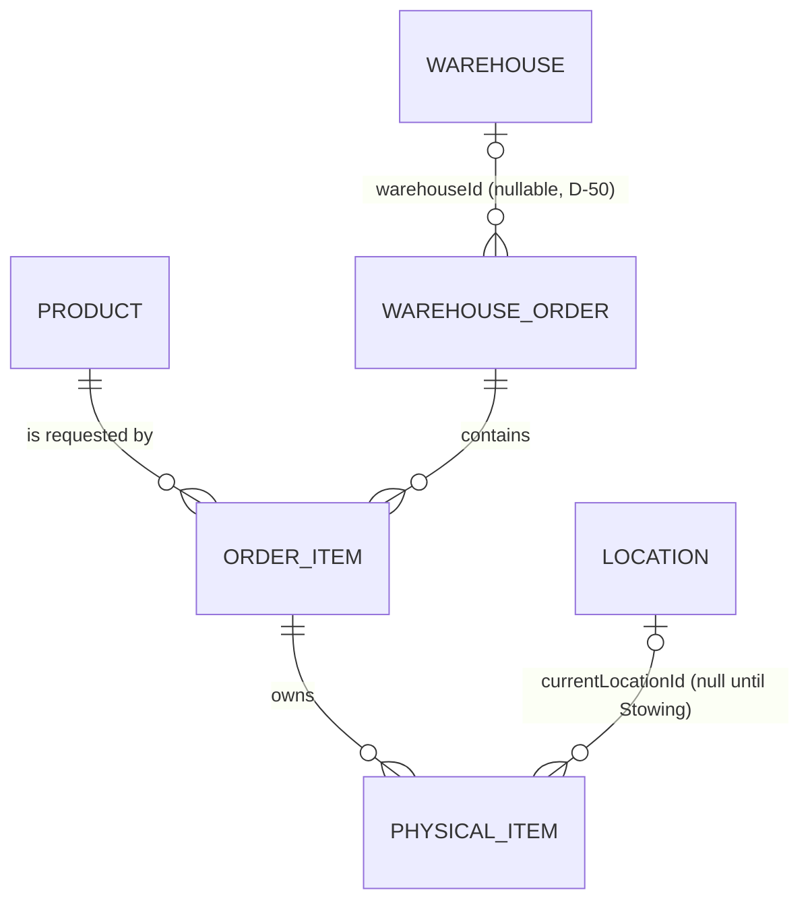

# Phase 2 — Design Proposal — Product & Order Item Identity Foundation

> **Status: DESIGN APPROVED (D-40 → D-59 all ✅ APPROVED) — IMPLEMENTATION NOT
> YET AUTHORIZED.**
> Phase 1 is ACCEPTED, TESTED, DEPLOYED and VERIFIED.
> **No production code, schema, migration, seed change, test or deployment
> has been produced — implementation starts only on a separate, explicit
> order.** Execution order: DESIGN → OPEN DECISIONS → USER REVIEW → APPROVAL
> → IMPLEMENTATION. Format follows `docs/PHASE-1-DESIGN-PROPOSAL.md`.
>
> **Review progress:** **D-40 → D-43** approved **individually** during the
> design-review session; **D-44 → D-59** approved as a **single batch**
> closing the comprehensive architectural review — with explicit rulings:
> D-50 = Phase-3 prerequisite · D-53 = `PI-XXXXXXXX` locked · D-55 = immutable
> product identity · **D-56 = Option B (content-aware idempotency)** ·
> **D-57 = strict cap**. Post-batch point-reviews: **D-64 = External Reference
> Normalization (Option A)** · **D-65 = living `contentHash` lifecycle
> (Option A1)**. All recorded here (§26) and in
> `docs/OPEN-DECISIONS.md` (§E).

---

## 0. Preamble — design basis

This proposal was produced from a full read of the current codebase:

- `backend/prisma/schema.prisma` (Phase 0 + Phase 1 models, enum conventions,
  `uuid()` PKs, `onDelete: Restrict`, `@@map` snake_case tables).
- `backend/prisma/seed.ts` (idempotent permission catalog `resource.action`,
  the 7 seeded system roles, the D-32 legacy-permission migration pattern).
- `backend/src/modules/**` (controller/service/DTO patterns, global
  `JwtAuthGuard` + `PermissionsGuard`, `AuditService` inside `$transaction`).
- `docs/ARCHITECTURE.md`, `docs/OPEN-DECISIONS.md` (decisions D-01…D-38 —
  Phase 2 therefore continues at **D-40**, as mandated).
- `frontend/src` (`NavItems` registry, `PermissionGate`, nested routes).
- `backend/test/*.e2e-spec.ts` (Jest + Supertest e2e conventions).

Everything below reuses the existing conventions; nothing new is invented
without justification.

---

## 1. Executive Summary

Phase 2 establishes the **digital identity and ownership foundation** for the
products that pass through AYROVI's purchasing/intermediation business:

- **Product** — the commercial identity of an item sold by an external store,
  identified by `store + externalProductCode` (namespaces are per-store).
- **WarehouseOrder** — a lightweight, warehouse-side projection of an external
  customer order (reference + external customer reference + status + source).
  It is explicitly **not** a CRM and stores no customer profile data.
- **OrderItem** — a requested product line on an order
  (`Order → OrderItem → Product`, `requestedQuantity ≥ 1`).
- **PhysicalItem** — **one unique identity per expected physical piece**,
  initially in state `EXPECTED`, owned by exactly one `OrderItem`, with a
  nullable `currentLocationId` that stays `NULL` until the future Stowing
  phase assigns a real location.

What Phase 2 deliberately does **not** do (full list in §25): no receiving,
stowing, picking, sorting, packing, shipping, no OCR, no CRM, no mobile app,
no bulk inventory quantities, no operational state transitions.

Deliverables after approval: 4 new tables (additive-only migration), 16 new
granular permissions, 12 new audit events, 4 REST resources under `/api/v1`,
3 permission-gated frontend sections, an e2e + unit test suite, and an
idempotency layer built on **database constraints** (not frontend checks).

---

## 2. Domain Model

```
Product  (commercial identity — "what is it")
   │ 1:N
   ▼
OrderItem (requested line — "how many are expected, for which order")
   │ 1:N
   ▼
PhysicalItem (unique piece identity — "this exact piece")

WarehouseOrder 1:N → OrderItem   (ownership of lines)
Location (Phase 1) 0..1 ← PhysicalItem.currentLocationId  (NULL until Stowing)
Warehouse (Phase 1) 0..1 ← WarehouseOrder.warehouseId     (nullable, D-50)
```

Conceptual tree:

```
WarehouseOrder ORD-1045 (external ref, customer ref, OPEN)
│
├── OrderItem #1  Product: NIKE / ABC123   requestedQuantity = 2
│     ├── PhysicalItem PI-9F3A2C11   EXPECTED   location = NULL
│     └── PhysicalItem PI-7B21E904   EXPECTED   location = NULL
│
├── OrderItem #2  Product: ZARA / XYZ456   requestedQuantity = 1
│     └── PhysicalItem PI-C48D0A72   EXPECTED   location = NULL
│
└── (order can have many lines; each line many pieces)
```

The same `Product` may appear in **many orders** (NIKE/ABC123 in order A and
order B are two different `OrderItem` rows owned by different orders, each
with its own `PhysicalItem` rows). Products are shared catalog identity;
pieces are order-owned operational identity. This distinction is the core of
Phase 2.

---

## 3. Product vs OrderItem vs PhysicalItem

| | **Product** | **OrderItem** | **PhysicalItem** |
|---|---|---|---|
| Answers | «What product is this?» | «How many of it does this order line request?» | «Which exact piece is this?» |
| Identity | `store + externalProductCode` (unique per store, D-44) + internal UUID | UUID + optional `externalLineReference` | **UUID per piece** (D-43) + generated `itemCode` |
| Cardinality | global catalog row | one per order line | one per expected/received physical piece |
| Owned by | nobody (shared catalog) | exactly one `WarehouseOrder` | exactly one `OrderItem` |
| Quantities | none | `requestedQuantity` (integer ≥ 1) | none — the row itself *is* one piece |
| Has location? | no | no | `currentLocationId = NULL` until Stowing (D-46) |
| Initial state | `ACTIVE` | `OPEN` | `EXPECTED` (D-45) |
| Mutable in P2 | name, type, description, attributes, status | quantity (before any piece exists), note, cancel | **nothing operational** — create / view / cancel only |
| Deleted? | never — deactivate (D-35) | never — cancel | never — cancel |

Explicitly rejected alternative: a generic `Inventory` aggregate
(`NIKE-ABC123 = 2`). AYROVI is customer-order driven; the system must answer
**«which physical piece belongs to which customer order»**, which a quantity
counter cannot do. Bulk quantities are NOT the primary model (mandate §9).

---

## 4. WarehouseOrder Architecture

`WarehouseOrder` is a **lightweight projection/reference** of an order that
lives in an external system (future CRM / administration). It carries the
minimum the warehouse needs to operate:

| Field | Purpose |
|---|---|
| `externalOrderReference` | stable external id (e.g. `ORD-1045`). **Unique** → natural idempotency anchor for retries (§17). |
| `externalCustomerReference` | stable external customer id (e.g. `CUST-10452`). **Reference only** — no customer record is created (D-42). Indexed for lookup/filtering. |
| `source` | provenance of the record: `ADMIN | CRM | OCR | API` — source-agnostic by design (mandate §14); the chain `Invoice → OCR → CRM/Admin → Warehouse API` terminates here but OCR itself is out of scope (§19). |
| `status` | `OPEN` / `CANCELLED` in Phase 2 (D-54). |
| `warehouseId` | **nullable** FK to the Phase 1 `Warehouse` (D-50): fulfilment warehouse may not be known at creation time; it must be set before Receiving (Phase 3). |
| `note` | optional free text for warehouse staff. |

Deliberately **absent**: customer name/address/contacts, payment data,
conversation/history, marketing data, totals/currency (no pricing exists in
the whole system). The authoritative customer record remains outside
Warehouse Core; the future boundary is `CRM ⇅ Warehouse API` (§18), never
direct DB access, and never a second CRM inside this system.

---

## 5. ERD

```
┌───────────────────────┐            ┌────────────────────────────┐
│ Product               │            │ Warehouse                  │
│───────────────────────│            │ (Phase 1, unchanged)       │
│ id            UUID PK │            │ id            UUID PK      │
│ store         text    │            └─────────────┬──────────────┘
│ externalProductCode   │                          │ 0..1
│ name          text    │                          ▼
│ productType   text?   │            ┌────────────────────────────┐
│ description   text?   │            │ WarehouseOrder             │
│ attributes    json?   │            │────────────────────────────│
│ status       ACTIVE/  │            │ id            UUID PK      │
│              INACTIVE │            │ externalOrderReferenceuniq │
└──────────┬────────────┘            │ externalCustomerReference  │
           │ 1:N                     │ source        enum         │
           ▼                         │ status        OPEN/CANCELLED│
┌───────────────────────┐            │ warehouseId   UUID null ───┘
│ OrderItem             │            │ note          text?         │
│───────────────────────│            └─────────────┬──────────────┘
│ id            UUID PK │                          │ 1:N
│ warehouseOrderId FK ──┼──▶ WarehouseOrder        ▼
│ productId FK ─────────┼──▶ Product ┌────────────────────────────┐
│ requestedQuantity int │            │ PhysicalItem               │
│ externalLineReference?│            │────────────────────────────│
│ status  OPEN/CANCELLED│            │ id            UUID PK      │
│ note          text?   │            │ orderItemId   FK ──────────┼──▶ OrderItem
└───────────────────────┘            │ itemCode      unique       │
                                     │ externalItemReference?     │
┌───────────────────────┐            │ status   EXPECTED (+reserv.)│
│ Location (Phase 1)    │◀───────────│ currentLocationId  null ───┘
│ unchanged             │  0..1      └────────────────────────────┘
└───────────────────────┘   currentLocationId (NULL until Stowing, D-46)
```

<details><summary>Mermaid (renders on GitHub)</summary>



</details>

---

## 6. Prisma Schema Proposal (to be applied to `schema.prisma` **on implementation only**) — revised per approved D-56 Option B: `contentHash` added to `WarehouseOrder`

Additive-only. Follows Phase 0/1 conventions: `uuid()` PKs, `@@map` snake_case
plural tables, status enums, `Restrict` FKs, rich comments. No second ID
strategy is introduced — internal identity is always the UUID `id`; human
codes (`itemCode`) are display/barcode identifiers, never the PK (D-31, D-53).

```prisma
// ------------------------------------------------------------------
// Phase 2 — Product & Order Item Identity Foundation
//
// SCOPE GUARD:
//   - Identity + ownership ONLY. NO receiving / stowing / picking /
//     sorting / packing / shipping workflows, NO OCR, NO CRM, NO
//     bulk inventory quantities, NO location assignment.
//   - PhysicalItem is born EXPECTED (D-45). The EXPECTED → RECEIVED
//     transition belongs to Phase 3 (Receiving) and is NOT implemented
//     here. currentLocationId stays NULL until Stowing (D-46).
//   - Deactivate / cancel rather than destroy (D-35): there is no
//     delete endpoint and no hard delete for any Phase 2 entity.
// ------------------------------------------------------------------

enum ProductStatus {
  ACTIVE
  INACTIVE
}

// Provenance of imported records (source-agnostic, mandate §14).
// Extending this enum later is a deliberate, additive migration.
enum OrderSource {
  ADMIN // created by warehouse staff in the back-office UI
  CRM   // pushed by the future CRM integration
  OCR   // pushed by the future administration/OCR pipeline (OCR itself is OUT OF SCOPE)
  API   // pushed by any other authorized internal integration
}

enum WarehouseOrderStatus {
  OPEN      // active order projection (Phase 2 uses only these two values; D-54)
  CANCELLED // cancelled before/without fulfilment
}

enum OrderItemStatus {
  OPEN
  CANCELLED
}

// Full lifecycle is RESERVED now (Phase 0 precedent A-03) so future
// phases extend behaviour, not the schema shape. Phase 2 may only SET
// EXPECTED (at creation) and CANCELLED. Any other transition is
// rejected with 409 until its dedicated phase implements it (D-47).
enum PhysicalItemStatus {
  EXPECTED  // Phase 2 initial state — expected to arrive, NOT received (D-45)
  RECEIVED  // reserved — Phase 3 (Receiving)
  STOWED    // reserved — future Stowing
  PICKED    // reserved — future Picking
  SORTED    // reserved — future Sorting
  PACKED    // reserved — future Packing
  SHIPPED   // reserved — future Shipping
  CANCELLED // expected piece that will never arrive (line/order cancelled)
}

model Product {
  id                  String        @id @default(uuid())
  store               String // external store name, e.g. "NIKE", "SHEIN" (normalized uppercase — D-44)
  externalProductCode String // the code AS USED BY THE STORE; unique only within `store` (D-44); stored normalized: trim + UPPERCASE (D-64)
  name                String
  productType         String? // free-text category (e.g. "Shoes") — D-48
  description         String?
  // Optional identity-completing attributes (size/color/...). Not a generic
  // PIM; only what operations need to disambiguate pieces. May stay unused.
  attributes          Json?
  status              ProductStatus @default(ACTIVE)
  createdAt           DateTime      @default(now())
  updatedAt           DateTime      @updatedAt

  orderItems OrderItem[]

  // D-44: the SAME external code under TWO stores is NOT the same product.
  @@unique([store, externalProductCode])
  @@index([store])
  @@index([status])
  @@map("products")
}

model WarehouseOrder {
  id                        String               @id @default(uuid())
  externalOrderReference    String               @unique // idempotency anchor (§17); normalized trim + UPPERCASE (D-64)
  externalCustomerReference String // reference ONLY — no CRM data (D-42)
  source                    OrderSource          @default(ADMIN)
  status                    WarehouseOrderStatus @default(OPEN)
  // D-50: fulfilment warehouse is optional at creation; must be set before
  // Receiving (Phase 3 concern). Multi-warehouse per D-20.
  warehouseId               String?
  warehouse                 Warehouse?           @relation(fields: [warehouseId], references: [id], onDelete: Restrict)
  note                      String?
  // D-56 Option B + D-65 (approved): LIVING SHA-256 of the canonical
  // SOURCE-OWNED payload — the order's CURRENT EFFECTIVE content. Computed
  // at creation and RECOMPUTED INSIDE THE SAME TRANSACTION on every
  // content-affecting mutation (order PATCH; line add; line quantity
  // change; line cancel; piece create with externalItemReference; piece
  // cancel). CANCELLED LINES ARE EXCLUDED from the canonical form.
  // Identical replay → 200; different content → 409 ORDER_CONTENT_CONFLICT.
  // Excludes `note`/`status` (warehouse-internal). Rules: §17.
  contentHash               String
  createdAt                 DateTime             @default(now())
  updatedAt                 DateTime             @updatedAt

  items OrderItem[]

  @@index([externalCustomerReference])
  @@index([status])
  @@index([warehouseId])
  @@map("warehouse_orders")
}

model OrderItem {
  id          String   @id @default(uuid())
  orderId     String
  order       WarehouseOrder @relation(fields: [orderId], references: [id], onDelete: Restrict)
  productId   String
  product     Product  @relation(fields: [productId], references: [id], onDelete: Restrict)
  requestedQuantity Int  // >= 1, enforced by DTO AND a DB CHECK constraint (§16)
  // Optional stable line reference supplied by the source system; when
  // present it is unique per order → retry-safe line idempotency (D-51).
  externalLineReference String?
  note        String?
  status      OrderItemStatus @default(OPEN)
  createdAt   DateTime @default(now())
  updatedAt   DateTime @updat line reference supplied by the source system; when
  // present it is unique per order → retry-safe line idempotency (D-51).
  externalLineReference String?
  note        String?
  status      OrderItemStatus @default(OPEN)
  createdAt   DateTime @default(now())
  updatedAt   DateTime @updatedAt

  physicalItems PhysicalItem[]

  @@unique([orderId, externalLineReference]) // Postgres: multiple NULLs allowed
  @@index([orderId])
  @@index([productId])
  @@index([status])
  @@map("order_items")
}

model PhysicalItem {
  id          String @id @default(uuid()) // THE unique per-piece identity (D-43)
  orderItemId String
  orderItem   OrderItem @relation(fields: [orderItemId], references: [id], onDelete: Restrict)

  // Human/barcode-readable display code (NOT the PK; D-31/D-53). Generated
  // server-side, format `PI-XXXXXXXX` (see §16.2), unique, immutable.
  itemCode String @unique

  // Optional source-supplied piece reference (serial, line-piece id…).
  // Unique within its order item; namespace questions → §17 / D-51.
  externalItemReference String?

  status PhysicalItemStatus @default(EXPECTED) // D-45

  // D-46: NULL until the future Stowing phase assigns a real location.
  // Phase 2 provides NO API that writes this column.
  currentLocationId String?
  currentLocation   Location? @relation(fields: [currentLocationId], references: [id], onDelete: Restrict)

  createdAt DateTime @default(now())
  updatedAt DateTime @updatedAt

  @@unique([orderItemId, externalItemReference]) // Postgres: multiple NULLs allowed
  @@index([orderItemId])
  @@index([status])
  @@index([currentLocationId])
  @@map("physical_items")
}
```

Two one-line edits are also required in **existing** models (additive,
non-breaking):

```prisma
model Warehouse  { …  orders WarehouseOrder[]   } // add relation field
model Location   { …  physicalItems PhysicalItem[] } // add relation field
```

And a **DB-level CHECK** added in the migration SQL (Prisma cannot express
it): `ALTER TABLE order_items ADD CONSTRAINT order_items_qty_positive CHECK (requestedQuantity > 0);`

---

## 7. Relationships (explicit)

| Relation | Cardinality | FK | `onDelete` | Justification |
|---|---|---|---|---|
| WarehouseOrder → OrderItem | 1:N | `order_items.orderId` | **Restrict** | Operational data is never hard-deleted (D-35); an order with lines cannot be deleted at all (no delete endpoint). |
| Product → OrderItem | 1:N | `order_items.productId` | **Restrict** | A product referenced by requested lines is historically meaningful; corrections = `INACTIVE` (deactivate), never delete. |
| OrderItem → PhysicalItem | 1:N | `physical_items.orderItemId` | **Restrict** | A line with expected pieces cannot be deleted; cancel the pieces/line instead. |
| Location → PhysicalItem | 0..1 : N | `physical_items.currentLocationId` (nullable) | **Restrict** | Consistent with all Phase 1 structure FKs. Nulling a piece's location must be an explicit future domain operation, never a side effect of deleting a location (which Phase 1 forbids anyway). |
| Warehouse → WarehouseOrder | 0..1 : N | `warehouse_orders.warehouseId` (nullable) | **Restrict** | Same principle; D-50. |

**Ownership immutability (mandate §22):** `orderItemId` is **not** part of any
update DTO and cannot be changed by any Phase 2 endpoint. A PhysicalItem can
never be silently reassigned to another OrderItem. If a future legitimate
reassignment need appears, it must be a dedicated, audited domain operation
(registered as an Open Decision at that time — not silently added).

## 8. Constraints

| # | Constraint | Type | Effect |
|---|---|---|---|
| C1 | `(store, externalProductCode)` UNIQUE | DB | Same external code under two stores = two products (D-44). Duplicate within a store → 409. |
| C2 | `externalOrderReference` UNIQUE | DB | Order-level idempotency anchor; a retry can never create a second order (§17). |
| C3 | `(orderId, externalLineReference)` UNIQUE (nullable) | DB | Line-level idempotency when the source supplies line refs (D-51). Postgres allows many NULLs → lines without refs are not over-constrained. |
| C4 | `(orderItemId, externalItemReference)` UNIQUE (nullable) | DB | Piece-level idempotency for sources that pre-identify pieces. |
| C5 | `itemCode` UNIQUE | DB | Human piece identity is globally unique. |
| C6 | `CHECK (requestedQuantity > 0)` | DB (raw SQL in migration) | Quantity integrity even outside the API. |
| C7 | All FKs `Restrict` | DB | Deactivate/cancel, never orphaned data (D-35). |
| C8 | `orderItemId` absent from every update DTO | API | Ownership immutability (§7). Global `whitelist + forbidUnknownFields` validation rejects any attempt with 400. |
| C9 | Only `EXPECTED`/`CANCELLED` settable in Phase 2 | Service | Any other `PhysicalItemStatus` transition → **409 Conflict** (state machine guard, D-47). |

## 9. Indexes

| Table | Index | Reason |
|---|---|---|
| `products` | `UNIQUE (store, externalProductCode)` | C1 + store-scoped lookup |
| `products` | `(store)`, `(status)` | filters |
| `warehouse_orders` | `UNIQUE (externalOrderReference)` | C2 |
| `warehouse_orders` | `(externalCustomerReference)` | "all orders of customer X" lookup (reference only) |
| `warehouse_orders` | `(status)`, `(warehouseId)` | filters |
| `order_items` | `UNIQUE (orderId, externalLineReference)` | C3 |
| `order_items` | `(orderId)`, `(productId)`, `(status)` | order detail join, product history, filters |
| `physical_items` | `UNIQUE (itemCode)` | C5 |
| `physical_items` | `UNIQUE (orderItemId, externalItemReference)` | C4 |
| `physical_items` | `(orderItemId)`, `(status)`, `(currentLocationId)` | line detail, EXPECTED-worklists (future), future location lookups |

Full-name search (`products.name ILIKE`) is served without a trigram index at
expected catalog scale; a trigram/GIN index can be added later as a pure
additive migration if profiling requires it (noted, not built now).

## 10. State Model

```
Product:        ACTIVE ⇄ INACTIVE                       (activate/deactivate endpoints; D-35)
WarehouseOrder: OPEN ──▶ CANCELLED                      (cancel endpoint; no delete)
                (future terminal states deferred, D-54)
OrderItem:      OPEN ──▶ CANCELLED                      (cancel endpoint)
PhysicalItem:   EXPECTED ──▶ CANCELLED                  (only Phase-2 transitions, D-45/D-47)

                EXPECTED → RECEIVED → STOWED → PICKED → SORTED → PACKED → SHIPPED
                ▲ reserved enum values exist; transitions are implemented by their
                  dedicated future phases (Receiving = Phase 3 first). In Phase 2 any
                  attempt to leave EXPECTED (other than CANCELLED) ⇒ 409 CONFLICT.
```

Rules:

- Creating a PhysicalItem always sets `EXPECTED`. The record existing does
  **not** mean the piece arrived (mandate §10).
- Cancelling is allowed from `EXPECTED` only (a `CANCELLED` piece is final).
- No Phase 2 endpoint writes `currentLocationId`; the column exists so future
  phases don't need a migration, and so the domain is honest about its own
  model (D-46).

**State-machine semantics (binding — verified in review Point #8):**

- **`CANCELLED` is TERMINAL** for `WarehouseOrder`, `OrderItem` and
  `PhysicalItem`: there is **no** un-cancel / re-open path; any further
  write (PATCH, new children, re-cancel) is rejected with **409**
  (§11 rows; tests O5 / L7 / F7). **No-op and invalid state transitions
  return 409 uniformly** across all four resources (`already active`,
  `already inactive`, `already cancelled`, `not in EXPECTED` — §11
  error-semantics convention).
- **Product `INACTIVE` is NOT terminal** (`ACTIVE ⇄ INACTIVE`): the
  activate path exists (the D-55 correction flow relies on it).
  Deactivation does **not** alter or invalidate existing references —
  current lines keep pointing at the inactive product. Any future
  creation-time state gating (`PRODUCT_INACTIVE` / `WAREHOUSE_INACTIVE`
  409s) is the pending **D-63 (NOT approved)** and is **not** Phase 2
  behavior — recorded as a dependency only.
- **Phase 2 cancellation is LOCAL (per-resource).** Cancelling an order
  does **not** by itself change its lines' statuses or the `contentHash`
  (lines stay `OPEN` until individually cancelled; `status` is excluded
  from the canonical form — D-56B/D-65). Cross-level propagation
  (cascade) is the pending **Cascade-A RECOMMENDATION (NOT approved)** —
  no Phase 2 endpoint performs it; lines/pieces are cancelled
  individually, each audited, each recalculating the hash per D-65 when
  content-affecting.
- **No Phase 2 transition assumes an undecided decision**: nothing in the
  state model depends on D-61 (locking) or Cascade A — both remain
  recorded as dependencies only.

---

## 11. API Map (`/api/v1` — to be implemented only after approval)

All routes require a valid JWT (global `JwtAuthGuard`) **and** the listed
permission (global `PermissionsGuard` re-resolved from DB per request).
Errors use the existing uniform envelope (`401` unauthenticated, `403`
missing permission, `404` unknown id, `400` validation, `409` conflict /
forbidden state transition). Every mutation is audited inside the same
transaction (existing `AuditService` pattern). List endpoints accept
`skip`/`take` pagination and return arrays, consistent with Phase 1.

**Error-semantics convention (binding for every Phase 2 endpoint):**

1. **`404`** = the resource identified by the **URL path** (including a
   nested parent such as `:orderId` / `:orderItemId`) does not exist.
   `404` is **never** used for a conflict or an invalid state.
2. **`400`** = the request violates the **contract**: malformed/invalid
   input, validation failure, forbidden/unknown fields, or a
   **body-referenced entity that does not exist** (`productId`,
   `warehouseId`). The same logical condition must map to the same code on
   every endpoint.
3. **`409`** = a conflict: duplicate external identity (C1/C3/C4),
   D-64 case-normalized collision, D-56B content conflict, or an
   invalid state (cancelled, already-<state>, D-47 transitions, D-57 cap).
4. **Evaluation precedence** where several could apply:
   **contract (400) → identity (200 replay / 409 duplicate·content) →
   state (409)** — e.g. a replayed order whose payload references an
   unknown `productId` returns **400**, never a replay verdict.
5. **`200` replay** (D-56B) applies only after the contract is valid.

**List/filter conventions (binding — final review):** `take` is capped
server-side at **200** (Phase 1 audit-list precedent:
`Math.min(take ?? 50, 200)`); invalid filter enum values (e.g. unknown
`status`) are a query-contract violation → **400**. `q` is a
case-insensitive contains-search over: products → `store`,
`externalProductCode`, `name`; warehouse-orders → `externalOrderReference`,
`externalCustomerReference`. Per D-64, filters compared against normalized
columns are normalized the same way (store/code filters upper-cased before
matching).

### Products (`/products`)

| Method & path | Permission | Request DTO | Response | Audit | Notable errors |
|---|---|---|---|---|---|
| `POST /products` | `products.create` | `CreateProductDto` | 201 `Product` | `PRODUCT_CREATED` | 400 validation · **409** duplicate `(store, externalProductCode)` (C1) |
| `GET /products` | `products.view` | query: `store?, status?, q?, productType?, skip?, take?` | 200 `Product[]` | — | 400 bad query |
| `GET /products/:id` | `products.view` | — | 200 `Product` | — | 404 |
| `PATCH /products/:id` | `products.update` | `UpdateProductDto` | 200 `Product` | `PRODUCT_UPDATED` | 404 · 400 (**immutable** `store`/`externalProductCode`, D-55) |
| `POST /products/:id/activate` | `products.activate` | — | 200 `Product` | `PRODUCT_ACTIVATED` | 404 · 409 already active |
| `POST /products/:id/deactivate` | `products.deactivate` | — | 200 `Product` | `PRODUCT_DEACTIVATED` | 404 · 409 already inactive |

### Warehouse Orders (`/warehouse-orders`)

| Method & path | Permission | Request DTO | Response | Audit | Notable errors |
|---|---|---|---|---|---|
| `POST /warehouse-orders` | `warehouse_orders.create` | `CreateWarehouseOrderDto` (may embed `items[]` → atomic create, incl. per-item `physicalItems[]`) | **201 created** · **200 idempotent replay when content is identical** · **409 `ORDER_CONTENT_CONFLICT` when content differs vs the order's current effective content (D-56B + D-65)** | `WAREHOUSE_ORDER_CREATED` (replay annotated in metadata, no new event) | 400 validation · 400 unknown `productId` / `warehouseId` · **409 content conflict (D-56B)** · 409 piece-count > `requestedQuantity` (D-57) |
| `GET /warehouse-orders` | `warehouse_orders.view` | query: `status?, source?, externalCustomerReference?, q (externalOrderReference), warehouseId?, skip?, take?` | 200 `WarehouseOrder[]` | — | 400 |
| `GET /warehouse-orders/:id` | `warehouse_orders.view` | — | 200 order **incl. `items[].product` + `items[].physicalItems`** | — | 404 |
| `PATCH /warehouse-orders/:id` | `warehouse_orders.update` | `UpdateWarehouseOrderDto` (`note?`, `warehouseId?`, `externalCustomerReference?`) | 200 `WarehouseOrder` | `WAREHOUSE_ORDER_UPDATED` | 404 · 400 unknown warehouse · 409 cancelled order |
| `POST /warehouse-orders/:id/cancel` | `warehouse_orders.cancel` | — | 200 `WarehouseOrder` | `WAREHOUSE_ORDER_CANCELLED` | 404 · 409 already cancelled |

### Order Items (`/warehouse-orders/:orderId/items` and `/order-items/:id`)

| Method & path | Permission | Request DTO | Response | Audit | Notable errors |
|---|---|---|---|---|---|
| `POST /warehouse-orders/:orderId/items` | `order_items.create` | `CreateOrderItemDto` (`productId`, `requestedQuantity`, `externalLineReference?`, `note?`, optional `physicalItems[]`) | 201 `OrderItem` | `ORDER_ITEM_CREATED` | **404 unknown order (URL parent)** · **400 unknown `productId` (body reference, §11 convention)** · 409 cancelled order · 409 duplicate `externalLineReference` (C3) |
| `GET /warehouse-orders/:orderId/items` | `order_items.view` | — | 200 `OrderItem[]` incl. product + piece counts | — | 404 |
| `GET /order-items/:id` | `order_items.view` | — | 200 `OrderItem` incl. pieces | — | 404 |
| `PATCH /order-items/:id` | `order_items.update` | `UpdateOrderItemDto` (`requestedQuantity?`, `note?`) — **no `productId`, no `orderId`** | 200 `OrderItem` | `ORDER_ITEM_UPDATED` | 404 · 400 · **409** quantity < non-cancelled piece count (D-57) · 409 cancelled line |
| `POST /order-items/:id/cancel` | `order_items.cancel` | — | 200 `OrderItem` | `ORDER_ITEM_CANCELLED` | 404 · 409 already cancelled |

### Physical Items (`/order-items/:orderItemId/physical-items`, `/physical-items/:id`)

| Method & path | Permission | Request DTO | Response | Audit | Notable errors |
|---|---|---|---|---|---|
| `POST /order-items/:orderItemId/physical-items` | `physical_items.create` | `CreatePhysicalItemDto` (`externalItemReference?`) — **no `orderItemId` in body** (ownership from URL), **no `status`**, **no `currentLocationId`** | 201 `PhysicalItem` (`EXPECTED`) | `PHYSICAL_ITEM_CREATED` | 404 unknown line · 409 line/order cancelled · **409** non-cancelled pieces ≥ `requestedQuantity` (D-57) · 409 duplicate `externalItemReference` (C4) |
| `GET /order-items/:orderItemId/physical-items` | `physical_items.view` | query: `status?` | 200 `PhysicalItem[]` | — | 404 |
| `GET /physical-items/:id` | `physical_items.view` | — | 200 `PhysicalItem` incl. line→order→product chain | — | 404 |
| `GET /physical-items` | `physical_items.view` | query: `status?, orderItemId?, productId?, store?, skip?, take?` | 200 `PhysicalItem[]` | — | 400 |
| `POST /physical-items/:id/cancel` | `physical_items.cancel` | — | 200 `PhysicalItem` | `PHYSICAL_ITEM_CANCELLED` | 404 · 409 not in `EXPECTED` |

Justification of the endpoint map (mandate §18): one resource per aggregate
with **nested creation under the owning parent** (ownership comes from the
URL, never from the body — structural prevention of §22's "invalid
PhysicalItem ownership"); flat `GET` lists with filters for operations and
future integrations; **no `DELETE` anywhere**; **no status-transition
endpoints** beyond cancel/activate-deactivate, which are the only transitions
Phase 2 owns. Cancel-as-endpoint (rather than `PATCH status`) follows the
Phase 1 `activate`/`deactivate` precedent and keeps transitions explicit and
auditable.

---

## 12. DTO Proposal (validation via existing global ValidationPipe)

```ts
// ---- products ----
CreateProductDto {
  store!: string                 // @IsString @MinLength(1) @MaxLength(80); trim + UPPERCASE (D-44/D-64)
  externalProductCode!: string   // @IsString @MinLength(1) @MaxLength(120); trim + UPPERCASE (D-64)
  name!: string                  // @IsString @MinLength(1) @MaxLength(200)
  productType?: string           // @IsOptional @IsString @MaxLength(80)        (D-48)
  description?: string           // @IsOptional @IsString @MaxLength(2000)
  attributes?: Record<string, unknown> // @IsOptional @IsObject
}
UpdateProductDto: PartialType(CreateProductDto) minus store/externalProductCode
                 // OmitType → immutable identity fields (D-55); 400 if sent

// ---- warehouse orders ----
CreateWarehouseOrderDto {
  externalOrderReference!: string    // @IsString @MinLength(1) @MaxLength(120); trim + UPPERCASE (D-64)
  externalCustomerReference!: string // @IsString @MinLength(1) @MaxLength(120); trim + UPPERCASE (D-64)
  source?: OrderSource               // @IsOptional @IsEnum → default ADMIN
  warehouseId?: string               // @IsOptional @IsString @IsUUID
  note?: string                      // @IsOptional @MaxLength(2000)
  items?: CreateOrderItemInput[]     // @IsOptional @ArrayMaxSize(500), validated recursively
}
UpdateWarehouseOrderDto { warehouseId?: string; externalCustomerReference?: string; note?: string }

// ---- order items ----
CreateOrderItemDto / CreateOrderItemInput {
  productId!: string             // @IsString @IsUUID
  requestedQuantity!: number     // @IsInt @Min(1) @Max(1_000_000)
  externalLineReference?: string // @IsOptional @MaxLength(120); trim-only (D-64)
  note?: string                  // @IsOptional @MaxLength(2000)
  physicalItems?: [{ externalItemReference?: string }] // @IsOptional @ArrayMaxSize(1_000_000) sanity bound ONLY; the real D-57 strict cap (pieces ≤ requestedQuantity) is a SERVICE-level check — a DTO validator cannot reference a sibling field; refs trim-only (D-64)
}
UpdateOrderItemDto { requestedQuantity?: number /* @IsInt @Min(1) */; note?: string }
// NO productId / orderId / status fields → 400 by unknown-field whitelist

// ---- physical items ----
CreatePhysicalItemDto {
  externalItemReference?: string // @IsOptional @MaxLength(120); trim-only (D-64)
} // NO orderItemId (URL-owned), NO status (always EXPECTED), NO currentLocationId (D-46)
```

Global `whitelist: true` + `forbidNonWhitelisted: true` (already enabled in
Phase 0) makes any attempt to smuggle `status`, `currentLocationId` or
`orderItemId` fail with 400 rather than being silently ignored.

## 13. Permission Map (16 new granular permissions — final catalog proposal)

Naming follows the existing `resource.action` convention (A-02); the four
resources are distinct — deliberately **not** a broad `inventory.manage`
(mandate §19). No delete action exists (D-35).

| Resource | Actions | Keys |
|---|---|---|
| `products` | view, create, update, activate, deactivate | `products.view` `products.create` `products.update` `products.activate` `products.deactivate` |
| `warehouse_orders` | view, create, update, cancel | `warehouse_orders.view` `warehouse_orders.create` `warehouse_orders.update` `warehouse_orders.cancel` |
| `order_items` | view, create, update, cancel | `order_items.view` `order_items.create` `order_items.update` `order_items.cancel` |
| `physical_items` | view, create, cancel | `physical_items.view` `physical_items.create` `physical_items.cancel` |

Note: `physical_items.update` intentionally **does not exist** in Phase 2 —
a PhysicalItem has no mutable field yet (§7/§10), so granting an update
permissiall 16 (existing `ALL` seed convention) | unchanged behavior |
| `WAREHOUSE_ADMIN` | all 16 | operational administration; owns the data domain |
| `WAREHOUSE_MANAGER` | view on all 4 · `products.update/activate/deactivate` · `warehouse_orders.update/cancel` · `order_items.update/cancel` · `physical_items.cancel` | mirrors D-34 precedent: **update/cancel yes, create no** |
| `INBOUND_WORKER` | view on all 4 | **no mutations** — receiving doesn't exist yet; its execute permissions arrive with Phase 3 (mandate §20) |
| `PICKER` | view on all 4 | no mutations; picking execute reserved for its phase |
| `PACKER` | view on all 4 | no mutations; packing execute reserved for its phase |
| `VIEWER` | view on all 4 (+ existing `audit.view`) | read-only everywhere |

Seed changes are **purely additive and idempotent** (upsert of new permission
keys + adding keys to role sets), exactly like the Phase 1 seed extension; no
existing grant is removed, so Phase 0/1 behavior is untouched.

> **Warehouse-scoped authorization — recorded explicit gap (NOT DEFINED, by
> mandate):** Phase 2 permissions are global (`resource.action`) with no
> per-warehouse read/write scoping of products/orders defined. The data
> model already supports scoping (`warehouse_orders.warehouseId`, nullable
> per D-50). Any scope-filtered access model is a **future decision — out of
> Phase 2 scope**; recorded here so it is not silently assumed at
> implementation.

## 15. Audit Event Map (extend `AuditAction` enum — additive)

**New events emitted by Phase 2 (12):**

| Event | Emitted by |
|---|---|
| `PRODUCT_CREATED` / `PRODUCT_UPDATED` / `PRODUCT_ACTIVATED` / `PRODUCT_DEACTIVATED` | products endpoints |
| `WAREHOUSE_ORDER_CREATED` / `WAREHOUSE_ORDER_UPDATED` / `WAREHOUSE_ORDER_CANCELLED` | order endpoints (idempotent replay → **one** audit row re-using `WAREHOUSE_ORDER_CREATED` with `metadata.replay=true` — see the metadata contract below) |
| `ORDER_ITEM_CREATED` / `ORDER_ITEM_UPDATED` / `ORDER_ITEM_CANCELLED` | order-item endpoints |
| `PHYSICAL_ITEM_CREATED` / `PHYSICAL_ITEM_CANCELLED` | physical-item endpoints |

`entityType` values: `product`, `warehouse_order`, `order_item`,
`physical_item`; `entityId` = row UUID.

**Audit metadata contract (binding — review Point #9):**

| Event family | Required `metadata` |
|---|---|
| `*_CREATED` | source-identity snapshot: `store`+`externalProductCode` (products) · `externalOrderReference`+`externalCustomerReference`+`source` (orders) · `itemCode`/`externalItemReference` + owning line/order refs (pieces) |
| `*_UPDATED` | field-level deltas: `{field: {from, to}}` |
| `*_ACTIVATED` / `*_DEACTIVATED` | `{from, to}` (+ business code) — matching the Phase 1 `_setStatus` precedent |
| `*_CANCELLED` | `{from: <previous status>}` (local cancellation — no cascade fields until Cascade-A is decided) |
| replay (D-56B) | action = the resource's `*_CREATED`, `metadata.replay=true` + matched `externalOrderReference` — an **intentional audit row without any entity mutation** (the «audit event without DB change» case; the 200-replay remains fully traceable) |

Rejected requests (`400/403/404/409`) write **no** audit rows in Phase 2 —
forensic monitoring of rejection storms is a future consideration, not a
Phase 2 contract. **Audit atomicity:** because every mutation and its audit
row are written in the same transaction (§11), an audit failure rolls back
the entire mutation — **an entity change can never exist without its audit
row, and an audit row can never exist without its entity change** (the
single sanctioned exception: the 200-replay audit row, which is an
intentional event with zero entity mutation).

**Reserved and NOT emitted by Phase 2 (mandate §21):** `ITEM_RECEIVED`,
`ITEM_STORED`, `ITEM_MOVED`, `ITEM_PICKED`, `ORDER_PACKED`,
`SHIPMENT_DISPATCHED` — these already exist in the enum since Phase 0
(A-03); Phase 2 adds no operational event, and emits none of them.

## 16. Validation Rules (mandate §22, mapped)

| Rule | Enforcement | Error |
|---|---|---|
| Duplicate external product code **within the same store** | pre-check + C1 unique | **409** `PRODUCT_DUPLICATE` |
| Same external code under **different stores** | allowed by design (D-44) — two distinct products | 201 both |
| Duplicate order reference | C2 unique **+ D-56 Option B content comparison** against the **current effective content** (living canonical hash §17, D-65): identical → 200 replay; different → **409 `ORDER_CONTENT_CONFLICT`**; corrections via explicit audited update paths | 200 / 409 |
| External identifier differing **only by letter case** (store+code / order ref / customer ref) | D-64 DTO normalization (trim + UPPERCASE) **before** C1/C2 uniqueness & D-56B comparison → canonical-form collision | **409** with existing id / 200-replay — **never a second entity** |
| Invalid Product reference (`productId` unknown) | service existence check — **body reference** | **400** (§11 convention; D-63 pending would add a state-409 for `INACTIVE` products) |
| Invalid OrderItem reference | URL-param existence check | 404 |
| `requestedQuantity <= 0` | `@IsInt @Min(1)` **and** DB CHECK C6 | 400 |
| Invalid PhysicalItem ownership | ownership from URL only; `orderItemId` absent from all DTOs (C8) | 400 attempt |
| Duplicate PhysicalItem identity | server-generated UUID PK + unique `itemCode` → duplicates impossible; duplicate `externalItemReference` → C4 | 409 |
| Invalid Location reference | Phase 2 has **no API** writing `currentLocationId`; future phases must validate existence + `ACTIVE` status (documented contract) | n/a (future) |
| Cross-warehouse references | `warehouseId` (when set) must exist; location-vs-order warehouse consistency is a **Receiving/Stowing-time** rule, documented for Phase 3 | 400 |
| Invalid state transitions | C9 service guard: leaving `EXPECTED` (except `CANCELLED`) → | **409** `STATE_TRANSITION_NOT_AVAILABLE_IN_PHASE_2` |
| PhysicalItem never silently reassigned | C8 + immutability (§7) | 400 |

### 16.2 `itemCode` generation rule (D-53)

`PI-` + first 8 chars of `uuidv4()` uppercased (e.g. `PI-9F3A2C11`),
collision-checked against the unique constraint with one retry. Rationale:
human-utterable and barcode-ready piece label, stable, decoupled from
external references (which may change format or contain sensitive patterns);
the UUID remains the sole internal identity (no second ID strategy, §16 of
the mandate — this is a display code, not a key, and it is documented here).

## 17. Idempotency Strategy (mandate §23)

Principle: **stability lives in the database, not in the frontend.** Every
integration retry either lands on a unique constraint or returns the existing
record.

| Replay of… | Anchor | Phase 2 behavior (proposed) |
|---|---|---|
| Same product | C1 `(store, externalProductCode)` | second POST → **409** with existing id in body; integration uses GET. (Alternative: `200` replay — rejected to keep catalog creation intentional; see D-56 discussion.) |
| Same order | C2 `externalOrderReference` + **living** canonical `contentHash` (D-56 **Option B** + D-65) | identical to the **current effective content** → **200 existing order** (`metadata.replay` audited); **different content → 409 `ORDER_CONTENT_CONFLICT`** — a correction can never be silently swallowed; corrections go through the explicit audited update paths → **no duplicate order is ever created**. |
| Same order line | C3 `(orderId, externalLineReference)` | same ref → **409** with existing line id (explicit, forces the source to dedupe); different refs = legitimately distinct lines (D-51, D-58). **A retried line WITHOUT `externalLineReference` is NOT deduplicated — it creates a second line** (legitimate per D-58; the approved retry-safety guidance is D-51's mandatory recommendation to always send the ref). Pieces are protected differently: ref-less piece retries are bounded by the D-57 cap (row below). |
| Same piece | C4 `(orderItemId, externalItemReference)` | same ref on same line → **409**; same ref on a **different** line → 409 ownership conflict (a piece is never re-homed by a retry). Pieces without `externalItemReference` rely on the D-57 count cap to prevent unbounded duplicate rows. |

**D-56 Option B mechanism (approved):** at creation the service computes a
canonical, deterministic representation of the SOURCE-OWNED payload —
`externalCustomerReference`, `source`, `warehouseId` (when provided) and
`items[]` (each line: `productId`, `requestedQuantity`,
`externalLineReference`, and `physicalItems[].externalItemReference`;
strings trimmed; lines sorted by `(externalLineReference, productId)`) —
serializes it (stable JSON, sorted keys) and stores its SHA-256 in
`warehouse_orders.contentHash`. On a replayed `externalOrderReference` the
same canonical hash is computed and compared: **equal → 200** replay
(audited `metadata.replay=true`); **different → 409
`ORDER_CONTENT_CONFLICT`** identifying the divergence — never a silent
ignore. `note` and `status` are excluded (warehouse-internal state, not
source content). An explicit audited PATCH **recalculates** the hash, so a
post-correction replay of the OLD content returns 409 — forcing the source
to re-sync. This implements the approved intent verbatim: *"no blind replay
hiding a correction or change to an existing order."*

**D-65 (approved) — living hash:** `contentHash` represents the order's
**current effective content** for its whole life: it is recomputed INSIDE
the same transaction on every content-affecting mutation —
`POST /warehouse-orders/:orderId/items` (line add), `PATCH
/order-items/:id` (quantity change), `POST /order-items/:id/cancel` (line
cancel), piece creation **when an `externalItemReference` is supplied**,
`POST /physical-items/:id/cancel` (piece cancel) — in addition to the
order-level PATCH itself. **Cancelled lines are EXCLUDED from the canonical
form**; the rest of the composition is unchanged from D-56B (no redesign).
Consequences: a replay matching the CURRENT effective content → 200; a
replay of stale content → 409 — in **both** directions of change, killing
both the false-conflict and the false-match failure modes. Per D-64,
external references are case-normalized (trim + UPPERCASE) before hashing
and comparison. Hash recomputation rides transactions that already exist
(and the D-61 locking transaction and D-62 cascade transaction, once those
are decided) — no new transaction boundaries are introduced by D-65.

**Order-level cancellation is status-only:** cancelling the ORDER does not
change its lines (cancellation is local — §10) and therefore does not
change `contentHash` (`status` is excluded; the lines remain `OPEN`).
A replay matching the effective content of a **CANCELLED** order returns
**200** with the existing order — its `status=CANCELLED` is visible in the
response. Replay **acknowledges; it never resurrects**: the order stays
`CANCELLED`, no rows are created, and a content mismatch returns 409
regardless of the order's status (identity precedes state per the §11
convention; the hash itself is status-blind per D-56B/D-65).

**Replay / idempotency matrix (consolidated — review Point #9):**

| Case | Result | Basis | Test |
|---|---|---|---|
| A — identical order replay | 200 existing · no rows · 1 audit row `replay=true` | D-56B | O2a |
| B — same ref, different content | 409 `ORDER_CONTENT_CONFLICT` | D-56B | O2b |
| C — status-only difference (replay of CANCELLED) | 200 ack, never resurrection | D-56B (status excluded) + §10 | O2j |
| D — note-only difference | 200 (note excluded from hash) | D-56B | — |
| E — case-only external-reference difference | normalized (D-64) → 200/409 per content — never a second entity | D-64 | O2d |
| F — replay after audited line addition | 200 vs new effective content · 409 vs stale | D-65 | O2e/O2f |
| G — replay after quantity change / piece mutation with ref / piece cancel | 200 vs recomputed content · 409 vs stale | D-65 | O2h |
| H — replay after line cancellation | 200 (cancelled line excluded) · stale → 409 | D-65 | O2g |
| I — product identical re-create | **409** (create is intentional; corrections = D-55 deactivate+recreate) | C1/D-55 | P2/P7 |
| J — retried line/piece WITHOUT external ref | line: second row created (D-58, not deduplicated — refs required per D-51) · piece: bounded by D-57 cap | D-51/D-58/D-57 | L4b / F2 |

Recommended integration contract (documented for the future CRM/OCR
pipeline): always send a stable `externalOrderReference`, per-line
`externalLineReference`, and per-piece `externalItemReference` when known —
then any retry with **identical content** is side-effect-free (lines and
pieces **without** external refs excepted — see row J and the line row
above), and any
content change is **rejected with 409** and must follow the explicit audited
update path. An `Idempotency-Key`
header mechanism was evaluated and **rejected** for Phase 2 (adds state/TTL
infrastructure; external references are stable and auditable). If
machine-to-machine sources later need it, it belongs with D-25
(api-clients auth) in the integration phase.

## 18. CRM Boundary (mandate §15)

- Warehouse Core stores **only** `externalCustomerReference` (D-42).
- Never stored: customer profiles, names, addresses, contacts, history,
  conversations, payments, marketing data, CRM ids of any other kind.
- The future boundary is `CRM ⇅ Warehouse API` (HTTP, authenticated —
  potentially via the existing `api_clients` table once D-25 lands); **no
  direct database access** by CRM, and no CRM tables in this database.
- Phase 2 implements **no CRM integration** — only the domain contract above.

## 19. OCR Boundary (mandate §24)

**OCR = OUT OF SCOPE.** No Google Vision / Tesseract / invoice-parser /
screenshot-parser / OCR microservice / OCR credentials / OCR UI — nothing is
added to `package.json`, `.env.example`, or `integrations/`. The future chain
`Invoice → OCR → CRM/Admin → Warehouse API` enters Warehouse Core exclusively
through the documented POST endpoints of §11, tagged with `source`. Phase 2
only guarantees that this ingestion contract is clean and idempotent (§17).

## 20. Frontend Architecture (existing app, permission-aware)

Kept inside the current React app; follows the `NavItems` registry +
`PermissionGate` + nested-route pattern of Phase 1. No demonstration-only
screens — each screen maps 1:1 to approved §11 endpoints.

```
NAV_ITEMS additions:
  { key: 'products',  label: 'Products', path: '/products', permission: 'products.view' }
  { key: 'orders',    label: 'Orders',   path: '/orders',   permission: 'warehouse_orders.view' }

Routes:
/products                       → ProductsModule (PermissionGate: products.view)
    list + filters (store, status, q) · create/edit modal (gated by products.create/update)
    · activate/deactivate (gated) · row → /products/:id detail (recent order lines)
/orders                         → OrdersModule (PermissionGate: warehouse_orders.view)
    list + filters (status, source, customer ref, q) · create wizard with item-lines editor
    (gated by warehouse_orders.create) · row → /orders/:id
/orders/:id                     → OrderDetail (header + cancel, gated warehouse_orders.cancel)
    ├── items table (add line gated order_items.create; edit qty gated order_items.update;
    │   cancel line gated order_items.cancel)
    └── per line: physical items chips (PI-XXXXXXXX, EXPECTED/CANCELLED)
        · add piece gated physical_items.create · cancel piece gated physical_items.cancel
```

New files: `frontend/src/modules/products/…`, `frontend/src/modules/orders/…`
(+`api.ts` typed clients), nav entries in `NavItems.ts`, routes in `App.tsx`.
Buttons that require write permissions render disabled/hidden exactly as
Phase 1 does — the backend remains the authority.

## 21. Module Structure (modular-monolith boundaries respected)

```
backend/src/modules/
├── catalog/                        # NEW module — commercial identity
│   ├── products/
│   │   ├── products.controller.ts
│   │   ├── products.service.ts
│   │   └── dto/ (create-product.dto.ts, update-product.dto.ts, list-products.query.ts)
│   └── catalog.module.ts
└── orders/                         # NEW module — order identity & ownership
    ├── warehouse-orders/ (controller, service, dto/)
    ├── order-items/      (controller, service, dto/)
    ├── physical-items/   (controller, service, dto/)
    ├── item-code.util.ts + item-code.util.spec.ts   # §16.2 generator
    └── orders.module.ts
```

Cross-module rule (D-11): the `orders` module validates/reads products
through the `catalog` module's **published service**, never by reaching into
catalog tables ad hoc; audit still flows through the shared `AuditService`;
no new shared state is introduced. `AuditAction` enum + `schema.prisma` are
extended only after approval.

## 22. Testing Plan (Jest + Supertest, mirroring existing conventions)

Unit specs beside sources (`item-code.util.spec.ts`, service-level guards);
e2e specs in `backend/test/` against a real DB, reusing the
`warehouse-structure.e2e-spec.ts` harness style.

**Products** (`products.e2e-spec.ts`)

| # | Case | Expected |
|---|---|---|
| P1 | create valid | 201, audited `PRODUCT_CREATED` |
| P2 | duplicate `(store, code)` | 409 (C1) |
| P3 | same code, different store | 201, two distinct products (D-44) |
| P4 | update name/type/attributes | 200, audited |
| P5 | update attempts on `store`/`externalProductCode` | 400 (D-55) |
| P6 | unauthenticated / unauthorized / revoked permission | 401 / 403 / 403 (immediate — JWT strategy re-resolves) |
| P7 | same store, `abc123` then `ABC123` (case-only difference) | **409** — D-64 normalization → C1 collision on canonical form (existing id in body) |
| P8 | list semantics: `take` > 200 capped to 200 (§11 conventions); invalid `status` filter → 400; `q` matches store/code/name case-insensitively | 200 (capped) / 400 / correct filtered set |

**WarehouseOrder** (`warehouse-orders.e2e-spec.ts`)

| # | Case | Expected |
|---|---|---|
| O1 | create with `items[]` atomic | 201 + order + lines (+ pieces) |
| O2a | **duplicate `externalOrderReference`, identical content** | 200 existing, **no second row** (D-56B replay) |
| O2b | **duplicate `externalOrderReference`, different content** | **409 `ORDER_CONTENT_CONFLICT`**, still exactly one row (D-56B) |
| O2c | replay of the OLD content after an audited PATCH correction | 409 (forces source re-sync — no blind replay) |
| O2d | create/replay with reference differing only by case (`ord-1` vs `ORD-1`) | normalized (D-64) → enters D-56B comparison; **never a second order** |
| O2e | replay matching the CURRENT effective content after an audited **line addition** | **200** (living hash recomputed in the line-add transaction — D-65) |
| O2f | replay with the OLD (stale) content after an audited line addition | **409 `ORDER_CONTENT_CONFLICT`** (D-65 — false-match killed) |
| O2g | replay matching after an audited **line cancellation** (cancelled line excluded from canonical form) | **200** (D-65) |
| O2h | replay matching after a **quantity change** / piece-with-external-ref created / piece cancelled | **200** only against the recomputed effective content (D-65 recalc set exercised) |
| O2i | replayed order whose payload contains an unknown `productId` | **400** — contract precedes identity (§11 evaluation precedence); no replay verdict, no row created |
| O2j | replay of a **CANCELLED** order whose payload matches its effective content | **200** acknowledgement (response shows `status=CANCELLED`) — **never resurrection**: order stays `CANCELLED`, zero new rows; the status-only cancel did **not** alter `contentHash` (D-56B/D-65, §10) |
| O3 | update note/warehouseId | 200, audited |
| O4 | unknown `warehouseId` / bad payload / unknown fields | 400 |
| O5 | cancel → PATCH rejected | 409 |
| O6 | create while missing `warehouse_orders.create` | 403 |
| O7 | list semantics: `q` case-insensitive contains over `externalOrderReference`/`externalCustomerReference` (D-64-normalized compare); `take` cap as P8 | correct filtered set |

**OrderItem** (`order-items.e2e-spec.ts`)

| # | Case | Expected |
|---|---|---|
| L1 | create with valid product + order | 201, correct ownership |
| L2 | quantity `0` / `-1` / non-integer | 400 (DTO) |
| L3a | unknown order in URL (`POST /warehouse-orders/:orderId/items`) | **404** (URL parent — §11 convention) |
| L3b | unknown `productId` in body (valid order) | **400** (body reference — §11 convention) |
| L4 | duplicate `externalLineReference` in same order | 409 (C3); same ref in another order → 201 (per-order namespace) |
| L4b | **retry a line WITHOUT `externalLineReference` twice** | **201 ×2 — two lines, by design** (not deduplicated: D-51/D-58; retry-safety requires the ref — §17 matrix row J) |
| L5 | reduce quantity below existing non-cancelled pieces | 409 (D-57) |
| L6 | attempt to change `productId`/`orderId` via PATCH | 400 unknown-field rejection |
| L7 | cancel line, then add piece to it | 409 |

**PhysicalItem** (`physical-items.e2e-spec.ts`)

| # | Case | Expected |
|---|---|---|
| F1 | create piece → unique `itemCode`, status `EXPECTED`, `currentLocationId = null` | 201 (D-43/D-45/D-46) |
| F2 | pieces up to `requestedQuantity` | 201 each; **next one → 409** (D-57) |
| F3 | duplicate `externalItemReference` (same line) | 409 (C4) |
| F4 | `externalItemReference` already used on **another line** | 409 ownership conflict |
| F5 | body contains `orderItemId` / `status` / `currentLocationId` | 400 (C8) |
| F6 | any transition `EXPECTED → RECEIVED/STOWED/…` attempt | 409 (C9, D-47) |
| F7 | cancel from `EXPECTED` → second cancel | 200 → 409 |
| F8 | `GET /physical-items` answers «which piece belongs to which order» | correct chain line→order→product |
| F9 | create/list pieces under an **unknown** `orderItemId` (nested parent) | **404** (URL parent — §11 convention), never 400/409 |

**Security (cross-cutting matrix):** every endpoint × {no token → 401, valid
token w/o permission → 403, permission revoked mid-session → 403 on next
request} (existing guard tests extended).

**Audit:** after each mutation test, assert `audit_logs` row exists with the
exact `AuditAction`, `entityType`, `entityId`, actor and ip; assert the §15
**metadata contract** per event family (`{from, to}` on status events,
field-deltas on updates, identity snapshot on creates); assert a **200
replay writes exactly one** `WAREHOUSE_ORDER_CREATED` row with
`metadata.replay=true` and **zero** entity-row changes; assert rejected
requests (`400/403/404/409`) write **no** audit rows; assert **audit
atomicity** — an injected audit failure rolls back the entire mutation
(no entity row ever exists without its audit row, §15); assert NO
`ITEM_RECEIVED`/`ITEM_PICKED`/… rows can ever be produced by Phase 2 routes.

**Integration-readiness / idempotency:** scripted double-send of identical
product / order / line / piece payloads → exactly one row each; 10× order
replay → still one order (§17).

**Regression:** existing `auth.e2e-spec.ts` + `warehouse-structure.e2e-spec.ts`
suites must remain green (Phase 0/1 untouched).

## 23. Migration Strategy (executed only after approval)

1. **Strategy:** one additive Prisma migration
   (`…_phase2_product_order_identity`): creates 4 tables (including
   `warehouse_orders.contentHash` — D-56B/D-65) + 5 enums + all
   indexes/constraints + the raw `CHECK` (C6); adds 2 relation fields to
   `warehouses`/`locations` models (no column changes on existing tables).
2. **Audit enum:** append 12 `AuditAction` values — additive enum extension
   is safe in PostgreSQL (no table rewrite, no data risk); no value is
   renamed or removed.
3. **Existing-data compatibility:** Phase 0/1 tables are untouched; there is
   no operational data to backfill (Phase 2 tables start empty). Phase 1
   structure (warehouses→…→locations) is referenced only by **nullable**
   FKs — zero impact on existing rows.
4. **Seed changes:** additive idempotent upserts (16 permissions; extended
   role sets; D-32-style legacy handling **not needed** — no legacy keys
   exist for these resources). Re-running seed remains safe.
5. **Rollback:** the migration's `down` script drops only the 4 new tables
   and the 12 enum values; because no Phase 0/1 table is altered (beyond
   relation metadata that maps to no column), rollback cannot damage existing
   data. New permissions granted to custom roles would remain as rows and are
   harmless (unknown to old code) — optionally pruned by an idempotent seed
   cleanup, decision at review.
6. **Order of operations on deploy:** `prisma migrate deploy` → `db:seed` →
   backend start (exactly the current `build.sh` sequence; nothing new).

## 24. Deployment Impact

Pipeline unchanged: `GitHub → Render → build.sh (build + migrate deploy +
seed) → Backend → PostgreSQL → Frontend`. No new service, no new env var, no
secret, no provider-specific feature. `render.yaml`, `build.sh`,
`docker/` untouched. Swagger (`/api/docs`) picks up the new tagged resources
automatically. Only deltas: the migration, the seed additions, backend
modules, frontend bundle. No `.env` changes → no secrets in Git (mandate §32).

## 25. Scope Guard (Phase 2 = OUT OF SCOPE list)

❌ Receiving (screen, workflow, scan, `EXPECTED→RECEIVED`) — Phase 3
❌ Stowing, location assignment (`currentLocationId` writes), shelf/PDA scan
❌ Picking / Sorting / Packing / Shipping / Carrier APIs
❌ OCR (any engine, parser, credential, UI, microservice)
❌ CRM (profiles, addresses, history, payments, marketing) — reference-only
❌ Bulk/traditional inventory quantities as primary model
❌ Mobile/PDA app, offline sync
❌ Bulk structure/order generation
❌ Any operational state transition (`ITEM_RECEIVED`… events remain un-emitted)
❌ Client-credentials machine auth (D-25, deferred)
✅ In scope: identity + ownership of Product / WarehouseOrder / OrderItem /
PhysicalItem, granular permissions, audit events for Phase 2 mutations,
idempotent ingestion contract, tests, docs.

## 26. Open Decisions — D-40 onward (final record; merged into `docs/OPEN-DECISIONS.md` §E — **all APPROVED**, design only)

| ID | Decision | Final status |
|---|---|---|
| **D-40** | **Product Identity** | **✅ APPROVED (Phase 2 Design Review).** A Product in Warehouse Core is identified by **`(store, externalProductCode)`** — the combination must be UNIQUE: `SHEIN + 12345678 = Product A`, `TEMU + 12345678 = Product B`; identical codes under different stores are **di* | **Product Identity** | **✅ APPROVED (Phase 2 Design Review).** A Product in Warehouse Core is identified by **`(store, externalProductCode)`** — the combination must be UNIQUE: `SHEIN + 12345678 = Product A`, `TEMU + 12345678 = Product B`; identical codes under different stores are **different Product records** (schema: constraint C1 `@@unique([store, externalProductCode])`, already proposed in §6/§8 — no change needed). Approved requirements: (1) external product identity stays **stable**; (2) Warehouse Core is **NOT** responsible for the external stores' complete product catalogs; (3) **NO** pricing, customer-facing catalog logic, product marketing data, or store scraping in Phase 2; (4) the Product entity is suitable for future ingestion from **OCR, CRM/order systems, external integrations, and future import services** — always through the defined API/integration boundaries (`source`-tagged), never by direct coupling of Warehouse Core tables to CRM/OCR databases; (5) Warehouse Core remains the **operational source of truth** for warehouse-side product identity; (6) the existing Phase 0/1 modular-monolith architecture is preserved. The Product / OrderItem / PhysicalItem separation (`1:N:N`, mandate §3) stays as proposed. **Implementation remains deferred.** |
| **D-41** | WarehouseOrder = lightweight CRM projection, not a CRM | **✅ APPROVED (as proposed, without modification).** `externalOrderReference` UNIQUE = idempotency anchor; `externalCustomerReference` = reference only (no customer record); `source` = ADMIN/CRM/OCR/API; Phase-2 `status` = OPEN/CANCELLED; `warehouseId` optional pending D-50; `note` allowed; **zero** CRM/customer-profile fields (name, address, phone, conversations, payments, marketing); external CRM/order system remains the data owner; future Packing/Shipping address needs resolved via API boundary (never by copying CRM data); future OCR submits order/customer references via API. Verbatim approved terms: `docs/OPEN-DECISIONS.md` §E. **Implementation deferred.** |
| **D-42** | `externalCustomerReference` only; zero customer profile data | **✅ APPROVED (as proposed, without modification).** Reference-only field on `warehouse_orders`: opaque (never interpreted/validated against the external system), String MinLength(1)/MaxLength(120), **non-unique** index (a customer legitimately holds many orders), no assumed CRM format; **no Customer model, no `customers` table, no customer record** inside Warehouse Core — ever, for any future need (name/address/shipping resolved via Integration/API boundary in the appropriate phase); used for traceability/linking only; OCR & CRM interact with it via API. Verbatim approved terms: `docs/OPEN-DECISIONS.md` §E. **Implementation deferred.** |
| **D-43** | One unique UUID identity per physical piece | **✅ APPROVED (as proposed, without modification).** PhysicalItem = one independent row per expected physical piece, each with its own internal UUID; `itemCode` unique/immutable (format details deferred to D-53); each piece belongs to exactly **one** OrderItem; **no piece reassignment via API in Phase 2**; `externalItemReference` optional and unique within its OrderItem; `requestedQuantity` determines the expected piece count (cap policy → D-57); the model is **never** converted into an inventory quantity model. Verbatim approved terms: `docs/OPEN-DECISIONS.md` §E. **Implementation deferred.** |
| **D-44** | Per-store product-code namespace | **✅ APPROVED (batch review).** `UNIQUE(store, externalProductCode)`; `store` normalized uppercase — direct application of approved D-40. |
| **D-45** | `EXPECTED` is the initial PhysicalItem state | **✅ APPROVED (as proposed).** Only Phase-2 transition: `→ CANCELLED`. |
| **D-46** | `currentLocationId` nullable | **✅ APPROVED (as proposed).** Never written in Phase 2. |
| **D-47** | Operational transitions deferred | **✅ APPROVED (as proposed).** Phase-2 guard returns 409 for any transition it does not own. |
| **D-48** | `productType` representation | **✅ APPROVED (as proposed).** Free text now; controlled taxonomy later only if filtering demands it (additive migration). |
| **D-49** | Customer display-name snapshot | **✅ APPROVED.** No customer name or any PII stored inside Warehouse Core; `externalCustomerReference` only; any future display of customer data happens via the API boundary. |
| **D-50** | Order↔warehouse binding | **✅ APPROVED.** `warehouseId` optional at creation, **mandatory before the first Receiving in Phase 3** — recorded as an explicit Phase-3 prerequisite (see «Phase 3 prerequisites»). |
| **D-51** | External reference policies (line & piece) | **✅ APPROVED (as proposed).** Optional; unique within the parent when present; with a mandatory recommendation that integration sources always send them. |
| **D-52** | Exceptional PhysicalItem states | **✅ APPROVED (as proposed).** No MISSING/LOST/DAMAGED in Phase 2; `CANCELLED` only. |
| **D-53** | Human piece label | **✅ APPROVED (as proposed).** `PI-XXXXXXXX`, unique, immutable, never a Primary Key; UUID remains the internal identity; no new format discussion at this stage. |
| **D-54** | WarehouseOrder terminal states | **✅ APPROVED (as proposed).** Phase 2 ships `OPEN`/`CANCELLED` only; no `COMPLETED` or other fulfilment states now. |
| **D-55** | Mutability of `store` / `externalProductCode` | **✅ APPROVED (immutable).** They are the product identity and are immutable after creation; a discovered error (including OCR misreads) = deactivate the wrong record + create the correct one, audited. |
| **D-56** | Duplicate `externalOrderReference` behavior | **✅ APPROVED — OPTION B.** Identical content → 200 idempotent replay; **different content → 409 Conflict**; content differences are never silently ignored; comparison via a clear canonical content mechanism (`contentHash`, §17); corrections only via the explicit audited update path. *"No blind replay hiding a correction or change to an existing order."* |
| **D-57** | Piece-count cap vs `requestedQuantity` | **✅ APPROVED — STRICT CAP.** `requestedQuantity` is the hard ceiling for PhysicalItems; creating more requires an explicit audited quantity update first; no silent bypass, no warning-only. |
| **D-58** | Duplicate lines without `externalLineReference` | **✅ APPROVED (as proposed).** Same Product may repeat within the same WarehouseOrder when no external line reference exists; `UNIQUE(orderId, productId)` deliberately NOT enforced (it would block legitimate lines). |
| **D-59** | `OrderSource` values & extension policy | **✅ APPROVED (as proposed).** Phase 2: `ADMIN/CRM/OCR/API`; any new source requires an explicit decision + an appropriate migration. |
| **D-64** | External Reference Normalization | **✅ APPROVED (Point #5 — Option A).** `store` keeps the D-44 policy **trim + UPPERCASE**; `externalProductCode`, `externalOrderReference`, `externalCustomerReference` = **trim + UPPERCASE**; `externalLineReference` / `externalItemReference` = **trim-only**. Normalization at the DTO edge: case-only-different collisions hit C1/C2 on the canonical form → **409** with the existing id; case-different replays enter the D-56B comparison — **never a second entity**. Verbatim terms: `docs/OPEN-DECISIONS.md` §E. |
| **D-65** | `contentHash` Lifecycle — living hash | **✅ APPROVED (Point #6 — Option A1).** `contentHash` is a **living** hash of the order's **current effective content**: recomputed inside the same transaction on every content-affecting mutation (order PATCH; line add; quantity change; line cancel; piece create with `externalItemReference`; piece cancel); **cancelled lines excluded** from the canonical form; the rest of the D-56B composition preserved **without redesign**. Match vs current → 200; stale → 409. Verbatim terms: `docs/OPEN-DECISIONS.md` §E. |

No other unresolved architectural question was discovered during this design;
per the mandate, any question raised during review/approval will be appended
here before implementation starts.

## 27. Acceptance Criteria (Phase 2 = ACCEPTED when all true)

1. Migration applies cleanly on a Phase-1 database (`prisma migrate deploy`)
   and is rollback-safe; Phase 0/1 data and behavior unchanged.
2. All 4 tables + constraints + indexes exist exactly as §6–§9.
3. Seed is idempotent (re-runnable) and grants exactly the §14 matrix.
4. Every §11 endpoint enforces auth (401) + permission (403) + validation
   (400) + conflict (409) behaviors **per the §11 error-semantics
   convention** (URL→404 · body-reference→400 · identity 200/409 · state 409 ·
   precedence contract→identity→state), verified by the §22 e2e suite.
5. Permission revocation takes effect on the next request (no stale JWT grants).
6. Every Phase-2 mutation writes the exact §15 audit event; no operational
   event (`ITEM_RECEIVED`…) is ever emitted by Phase 2 code.
7. Idempotency: replayed product/order/line/piece payloads never create
   duplicates; an order replay with **differing content returns 409
   `ORDER_CONTENT_CONFLICT`** (D-56 Option B + D-65: compared against the
   order's **current effective content** — case-normalized references per
   D-64, cancelled lines excluded from the canonical form); piece counts can
   never exceed `requestedQuantity` (D-57 strict cap) (§17, §22
   integration-readiness tests green).
8. A PhysicalItem cannot leave `EXPECTED` (except `CANCELLED`), cannot be
   reassigned, and is created with `currentLocationId = null` only.
9. `GET /physical-items` answers «which piece belongs to which customer
   order» in one query chain (piece → line → order → product).
10. Frontend shows Products/Orders only with the right view permissions and
    gates every mutation button; backend re-checks everything.
11. Existing test suites (auth, warehouse-structure) remain green; Swagger
    documents all new endpoints; no secrets committed; Render pipeline
    deploys unchanged.

---

### Phase 3 prerequisites (recorded at design review so they are NOT forgotten)

1. **D-50 (approved):** `warehouse_orders.warehouseId` is optional at
   creation but becomes **mandatory before the first Receiving action** —
   Phase 3 must enforce this explicitly and test it.
2. **D-45/D-47:** the `EXPECTED → RECEIVED` transition is owned by Phase 3
   (Receiving); the location-vs-order warehouse consistency rule (§16) is
   enforced at receiving/stowing time.
3. **D-53:** `itemCode` (`PI-XXXXXXXX`) becomes the barcode label of the
   receiving workflow.

### Delivery & next step

The design is now **fully approved (D-40 → D-59)** — this approves the
**DESIGN ONLY**. Implementation has **NOT** been authorized: no code, no
migration, no seed change, no tests, no deployment. It begins only on a
separate, explicit implementation order, then follows: implement §6–§24 (as
amended by the approved decisions) → migrate → tests → deploy → acceptance.
